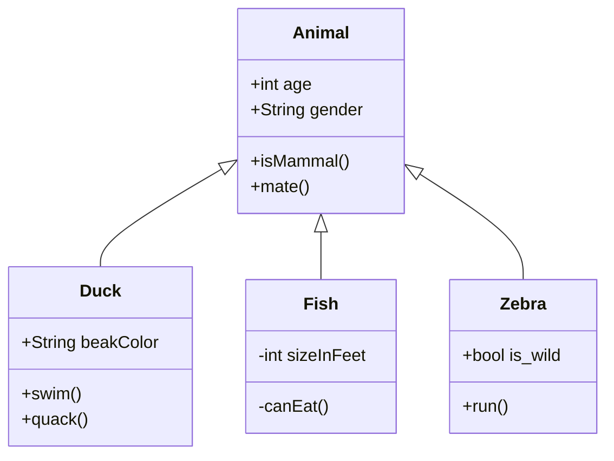

## Class: ManifestXml

### Description
The `ManifestXml` class represents a manifest file parser used for parsing and manipulating project manifest files consumed by EdkRepo. It provides methods to parse, access, and modify various attributes of the manifest, and generate new manifest and pin files.

The manifest `ManifestXml` class does not validate the contents of manifest files for correctness beyond adherence with the project manifest file schema.

Per Pep8 methods and attributes beginning with `_` or `__` should be considered private and not directly invoked by consumers of this module.

### Class Diagram

### Attributes
- `_project_info`: Stores the contents of the *ProjectInfo* subroot.
- `_general_config`: Stores the contents of the *GeneralConfig* subroot.
- `_remotes`: Stores the contents of the *RemoteList* subroot as a dictionary with the remote name as the key. Each unique *Remote* subtree is a separate entry.
- `_client_hook_list`: Stores the contents of the *ClientGitHookList* subroot.
- `_combinations`: Stores the contents of the *CombinationList* subroot as a dictionary with the combination name as the key. Each unique *Combination* subtree is a separate entry.
- `_combo_sources`: Lists of the *RepoSource* objects used by each combination stored as a dictionary with the combination name as the key. Each unique *Combination* is a separate entry.
- `_dsc_list`: Stores the contents of the *DscList* subroot as a list.
- `_sparse_settings`: Stores sparse checkout settings.
- `_sparse_data`: Stores sparse data objects.
- `_commit_templates`: Stores commit message templates.
- `_folder_to_folder_mappings`: Stores folder-to-folder mapping objects.
- `_submodule_alternate_remotes`: Stores submodule alternate remotes.
- `_submodule_init_list`: Stores submodule initialization entries.
- `_patch_sets`: Stores patch sets.
- `_patch_set_operations`: Stores patch set operations.

### Methods
- `__init__(self, fileref)`: Initializes the `ManifestXml` object with a file reference.
- `is_pin_file(self)`: Checks if the manifest file is a pin file.
- `add_combo(self, element)`: Adds a combination to the manifest.
- `_add_combo_source(self, subroot, combo)`: Adds sources to the combination.
- `_add_unique_item(self, obj, item_dict, tag)`: Adds a unique item to a dictionary.
- `_tuple_list(self, obj_list)`: Converts a list of objects to tuples.
- `write_current_combo(self, combo_name, filename=None)`: Writes the current combo to the manifest.
- `write_source_manifest_repo(self, manifest_repo, filename=None)`: Writes the source manifest repository to the manifest file.
- `write_tree(self, filename=None)`: Writes the manifest tree to a file.
- `generate_pin_xml(self, description, combo_name, repo_source_list, filename=None)`: Generates a pin XML file.
- `generate_pin_json(self, description, combo_name, repo_source_list, filename=None)`: Generates a pin JSON file.
- `equals(self, other, ignore_current_combo=False)`: Checks if two manifest objects are equal.
- `get_all_patchsets(self)`: Returns a list of all patch sets.
- `get_patchset(self, name, remote)`: Gets a specific patch set.
- `get_patchsets_for_combo(self, combo=None)`: Gets patch sets for a specific combination.
- `get_parent_patchset_operations(self, name, remote, patch_set_operations)`: Gets parent patch set operations.
- `get_patchset_operations(self, name, remote)`: Gets patch set operations.
